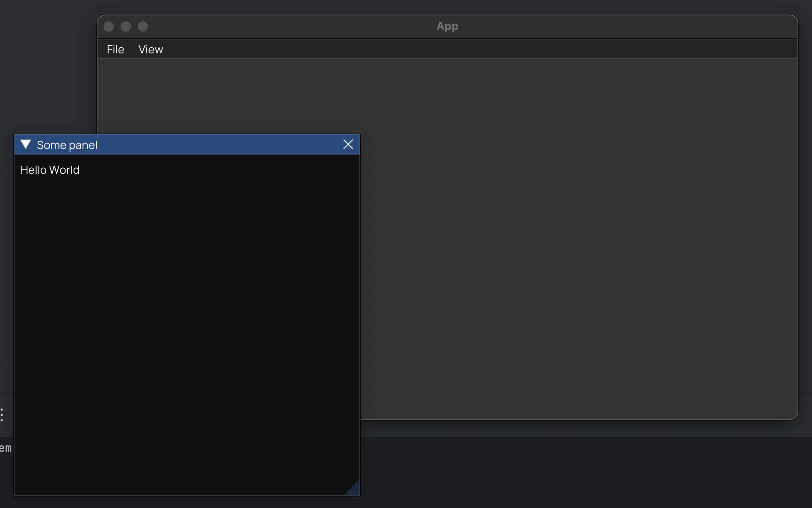

# Base GUI project setup with SDL2 and OpenGL

C++ GUI project template with [SDL2](https://www.libsdl.org) and [Dear ImGUI](https://github.com/ocornut/imgui) with
OpenGL 4.1.

## How to get started

After using this template to create your own repository, it is time to first run and then customize!

- Start here: [Quick Start](docs/QuickStart.md)
- Continue here: [Usage Guide](docs/README.md)

## Other versions

There is also a [SDL2 version using the SDL2 Renderer](https://github.com/MartinHelmut/cpp-gui-template-sdl2) instead of
OpenGL specifically, but it does not support multi-viewports or detached widgets.

## Disclaimer

Special acknowledgment to the amazing open source font [Manrope](https://manropefont.com).
